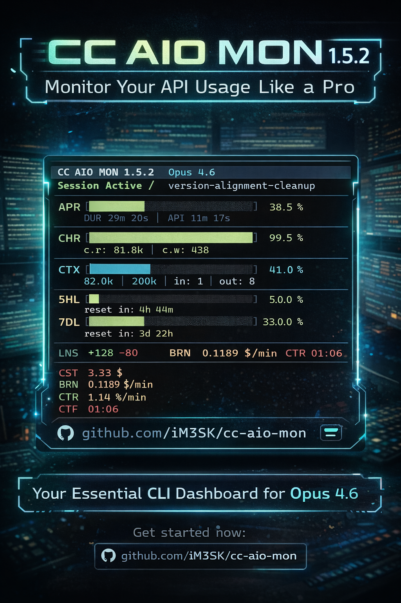

# CC AIO MON

      

**Real-time terminal monitor for Claude Code** — context window, API rate limits, session costs, and burn rate. Zero dependencies (stdlib only): `monitor.py`, `statusline.py`, and shared `rates.py`, cross-platform.



### How is this different?

| Project | Approach | Limitation |
|---------|----------|------------|
| claude-monitor | Reads JSONL cost logs | Estimated data, not real-time |
| ccusage | CLI usage aggregator | Historical only, no live dashboard |
| ccstatusline | Status line script | No TUI, no multi-session |
| **CC AIO MON** | Official statusline JSON | Real-time, zero deps, most compact |


## Quick Start

**1. Download**

```bash
git clone https://github.com/iM3SK/cc-aio-mon.git
```

**2. Configure statusline** — add to `~/.claude/settings.json`:

```json
{
  "statusLine": {
    "type": "command",
    "command": "python \"/path/to/cc-aio-mon/statusline.py\""
  }
}
```

On Windows, use forward slashes: `"python \"C:/path/to/statusline.py\""`

**3. Launch the dashboard**

```bash
python cc-aio-mon/monitor.py
```

Three files, zero dependencies, no install step. Optionally add a shell alias: `alias mon='python /path/to/monitor.py'`

## Features

- **Most compact monitor** — all critical metrics in one screen. No scrolling, no tabs, no wasted space.
- **Zero dependencies** — stdlib-only Python. No pip install, no venv, no node_modules.
- **Two-tier architecture** — lightweight statusline (updates on each Claude Code event) + fullscreen TUI dashboard.
- **Real-time metrics** — context window, API ratio, 5-hour and 7-day rate limits, cost, burn rate, context rate — all with progress bars and fixed ranges.
- **Smart warnings** — automatic alerts in header when context fills in < 30 min, rate limits > 80%, or burn rate exceeds threshold.
- **Cross-session costs** — TDY (today) and WEK (rolling 7-day) aggregate cost across all sessions.
- **Cross-platform** — Windows (Terminal, PowerShell, Git Bash), macOS (Terminal, iTerm2), Linux.
- **Nord color palette** — truecolor ANSI output with consistent color-coded sections.
- **Responsive layout** — statusline drops segments to fit narrow terminals. Dashboard adapts to any terminal size.
- **Multi-session support** — auto-detects active sessions. Numbered picker when multiple sessions are running. Session switching available anytime via `s` key.
- **Stale detection** — session data older than 30 minutes dims all metrics and shows inactive duration in the session status line. Last known values remain visible.
- **Security hardened** — path traversal prevention, escape injection protection, atomic file reads/writes, file size limits.

## Usage

### Statusline

Runs automatically on each Claude Code status update. Outputs a single colored line below the input area with Nord bar background that extends to full terminal width. Left side: model, API ratio, context %, cache hit rate, rate limits. Right side: burn rate, context rate, context full ETA, cost, duration, clock. Right segments drop when the terminal is narrow.

### Dashboard

```bash
python monitor.py              # auto-detect session
python monitor.py --session ID # specific session
python monitor.py --list       # list active sessions
python monitor.py --refresh 1000  # custom refresh interval (ms, default 500)
```

### Session Picker

The session picker is shown on launch when multiple sessions are available or accessible anytime by pressing `s`. Press `1-9` to select a session. The picker lists both live and stale sessions — sessions marked `(stale)` haven't received updates in over 30 minutes. With exactly one session file total (active, not stale), the monitor connects automatically without showing the picker. If multiple session files exist (even if only one is active), the picker is shown.

### Keyboard Shortcuts

| Key | Action |
|-----|--------|
| `q` | Quit |
| `r` | Force refresh data (resets stale timer) |
| `l` | Toggle legend overlay |
| `s` | Switch session (return to picker) |
| `1-9` | Select session (picker) |

## Metrics Reference

### Statusline Segments

Left-aligned (always visible):

| Code | Color | Metric |
|------|-------|--------|
| (model) | white | Model display name |
| APR | green | API Ratio — time in API calls vs total session duration |
| CTX | cyan | Context Window — percentage and token count (used/total) |
| CHR | green | Cache Hit Rate — cache reads vs total cache operations |
| 5HL | dynamic | 5-Hour Rate Limit — yellow/red by usage % |
| 7DL | dynamic | 7-Day Rate Limit — yellow/red by usage % |

Right-aligned (dropped from right when terminal is narrow):

| Code | Color | Metric |
|------|-------|--------|
| BRN | orange | Cost burn rate ($/min) |
| CTR | yellow | Context consumption rate (% / min) |
| CTF | red | Context Full ETA — predicted time to 100% |
| CST | orange | Total session cost (USD) |
| DUR | dim | Session duration |
| NOW | dim | Current local time |

### Dashboard Metrics

| Code | Color | Metric |
|------|-------|--------|
| APR | green | API Ratio — time in API calls vs total session duration |
| DUR | dim | Session duration (sub-stat under APR, displayed as `DUR 10m 04s`) |
| API | dim | API time (sub-stat under APR, displayed as `API 2m 35s`) |
| CHR | green | Cache Hit Rate — cache reads vs total cache operations |
| c.r | green | Cache read tokens (sub-stat under CHR, displayed as `c.r: 43.6k`) |
| c.w | green | Cache write tokens (sub-stat under CHR, displayed as `c.w: 728`) |
| CTX | cyan | Context Window — percentage and token count (used/total) |
| 5HL | dynamic | 5-Hour Rate Limit — yellow/red by usage %, shows reset countdown |
| 7DL | dynamic | 7-Day Rate Limit — yellow/red by usage %, shows reset countdown |
| BRN | orange | Burn rate — progress bar 0-1.0 $/min |
| CTR | yellow | Context rate — progress bar 0-5.0 %/min |
| CST | orange | Session cost — progress bar 0-$50 |
| TDY | orange | Today's cost aggregated across all sessions (sub-stat under CST) |
| WEK | orange | Rolling 7-day cost across all sessions (sub-stat under CST) |
| NOW | white | Current local time |
| UPD | white | Time since last data update |
| LNS | white | Lines changed — added (green) / removed (red) values |

### Reading the Dashboard

**APR (API Ratio)** — How much of your session time is spent waiting for the API vs thinking/typing. A low APR (e.g. 15%) means Claude is responding quickly relative to total session time. A high APR means most time is spent in API calls.
- Sub-stats: `DUR` = total session duration, `API` = time spent in API calls.

**CHR (Cache Hit Rate)** — Percentage of cached tokens that were read (reused) vs created (new). High CHR (>90%) means prompt caching is working well — you're paying less for repeated context. Low CHR means most cache tokens are being written, not reused.
- Sub-stats: `c.r` = cache read tokens, `c.w` = cache write (creation) tokens.

**CTX (Context Window)** — How full the context window is. When it hits 100%, Claude Code will start compressing earlier messages.
- Sub-stats: used tokens, input/output token counts.

**5HL / 7DL (Rate Limits)** — Usage against Anthropic's 5-hour and 7-day rate limits. When either hits 100%, you're throttled until the window resets. The countdown shows time remaining until reset.

**BRN (Burn Rate)** — Cost per minute ($/min), progress bar with fixed range 0-1.0 $/min. Calculated from session history.

**CTR (Context Rate)** — Context consumption rate (%/min), progress bar with fixed range 0-5.0 %/min.

**CST (Cost)** — Total session cost in USD, progress bar with fixed range 0-$50.

**TDY / WEK (Cross-Session Cost)** — Aggregated cost across all sessions. TDY = today, WEK = rolling 7-day window (not calendar week). Displayed as sub-stats under CST.

**LNS (Lines Changed)** — Lines added (green) and removed (red) during the session.

**NOW** — Current local time. **UPD** — Time since last data update from Claude Code.

### Color Thresholds

Most progress bars use these thresholds:

- **Green** (< 50%) — healthy, plenty of headroom
- **Yellow** (50-79%) — approaching limits
- **Red** (>= 80%) — critical, take action

Exception: 5HL/7DL rate limit labels use yellow as base color (even below 50%) to distinguish them from performance metrics. The progress bar itself follows the standard green/yellow/red thresholds.

## Configuration

| Variable | Default | Scope | Description |
|----------|---------|-------|-------------|
| `CLAUDE_STATUS_WARN` | `50` | statusline | Yellow threshold (%) |
| `CLAUDE_STATUS_CRIT` | `80` | statusline | Red threshold (%) |
| `CLAUDE_WARN_BRN` | `0.50` | dashboard | Burn rate warning threshold ($/min) |

```bash
export CLAUDE_STATUS_WARN=60
export CLAUDE_STATUS_CRIT=90
```

## How It Works

```
Claude Code ──stdin──> statusline.py ──> terminal (one-line status)
                            |
                            v
                    $TMPDIR/claude-aio-monitor/
                    ├── {session_id}.json    (current state, atomic write)
                    └── {session_id}.jsonl   (timestamped history)
                            |
                            v
                      monitor.py ──> terminal (fullscreen TUI)

Both statusline.py and monitor.py import rates.py for shared BRN/CTR calculation.
```

1. **statusline.py** receives JSON from Claude Code via stdin on each status update.
2. Outputs a colored one-line summary to the terminal.
3. Writes session state atomically to a temp directory for the monitor.
4. Appends timestamped entries to a JSONL history file for burn rate calculation.
5. **monitor.py** polls the temp directory, renders a fullscreen dashboard with bars, stats, and computed metrics.

<details>
<summary>IPC and security details</summary>

### IPC Details

- State files: atomic write via `NamedTemporaryFile` + `os.replace()` (no partial reads)
- History: append-only JSONL written only after the snapshot write succeeds — keeps `.json` and `.jsonl` in sync; auto-trimmed when file exceeds 1 MB (keeps last 1000 entries)
- Stale `.tmp` files older than 60 seconds cleaned up automatically
- Session detection: files older than 30 minutes marked as stale — all metrics dimmed (last known values preserved), session status line shows `Session Inactive` with duration

### Security

| Measure | Protection |
|---------|------------|
| Session ID validation | Strict regex `[a-zA-Z0-9_-]{1,128}` prevents path traversal |
| Input sanitization | C0 and C1 control characters (`\x00–\x1f`, `\x7f–\x9f`) stripped from string fields (model, session name, cwd) before terminal output |
| File size limits | JSON capped at 1 MB, JSONL at 10 MB — oversized files skipped |
| Atomic writes | Unpredictable temp filenames prevent symlink attacks |
| TOCTOU prevention | File reads use single open + bounded read instead of separate stat + read |
| Directory permissions | Temp directory created with `0o700` where supported |
| Graceful shutdown | SIGTERM handler + atexit ensure terminal state is always restored |
| Render isolation | Corrupted data caught per-frame — does not crash the TUI |

</details>

## Requirements

- **Python 3.8+** (stdlib only — no pip install needed)
- **Claude Code** with statusline support
- **Terminal with truecolor** — Windows Terminal, iTerm2, Alacritty, Kitty, most modern terminals
- **80 columns** minimum recommended

## Troubleshooting

**Monitor shows "Waiting for Claude Code session..."**
- Ensure Claude Code is running with an active session.
- Check that `statusLine.command` is configured in `~/.claude/settings.json`.
- Verify temp files exist: `%TEMP%/claude-aio-monitor/` (Windows) or `/tmp/claude-aio-monitor/` (macOS/Linux).

**Statusline not appearing**
- Verify the path in `statusLine.command` is correct and uses forward slashes.
- Test manually: `echo '{"context_window": {"used_percentage": 42}}' | python statusline.py`

**Raw escape codes visible / characters scrolling down the screen**
- Your terminal does not support ANSI escape sequences. The monitor checks `isatty()` and `TERM=dumb` on startup and exits with an error if either fails.
- Use a terminal with ANSI support: **Windows Terminal**, iTerm2, xterm, Kitty, Alacritty, or any modern terminal emulator.
- Terminals known to cause this: standalone `cmd.exe`, some older PowerShell console windows, any terminal with `TERM=dumb`.
- Quick test: `python -c "print('\033[32mGREEN\033[0m')"` — if you see `[32mGREEN[0m` instead of colored text, your terminal lacks ANSI support.

**Garbled output / encoding errors on Windows**
- Run `chcp 65001` in your terminal for UTF-8 mode.
- Both scripts auto-detect and override stdout encoding, but the terminal must support UTF-8 fonts.

**Monitor not responding to keyboard**
- On Windows, the terminal window must have focus for `msvcrt.getch()` to work.
- Press `q` to quit, `Ctrl+C` as fallback.

## Contributing

Contributions welcome. Keep zero-dependency (stdlib only), ship `rates.py` alongside the two entry scripts, test on Windows and at least one Unix platform. Run `python -c "import py_compile; [py_compile.compile(f, doraise=True) for f in ('rates.py','statusline.py','monitor.py')]"` before submitting.

## License

MIT License. See [LICENSE](LICENSE) for details.

---

[Changelog](CHANGELOG.md)
