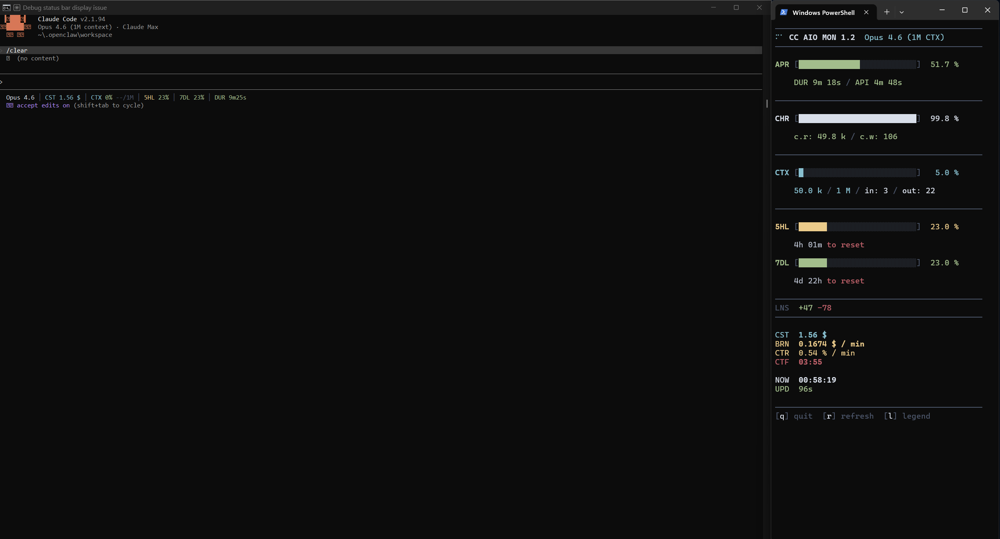
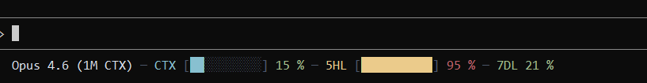
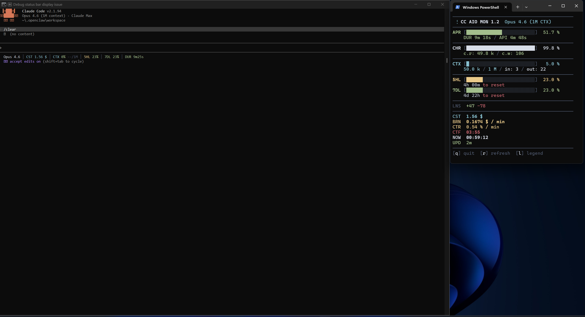
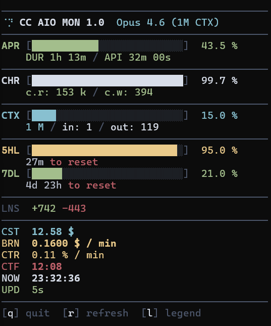
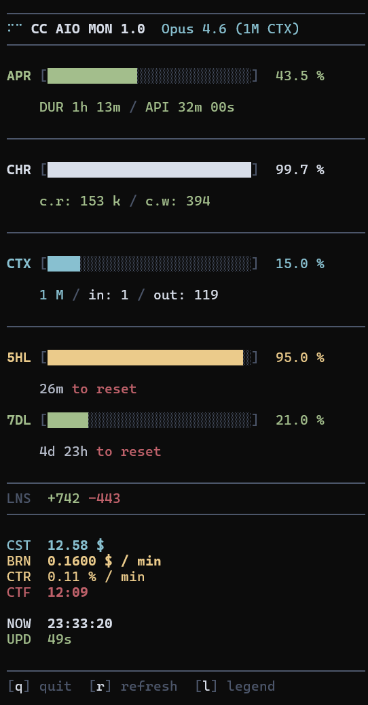
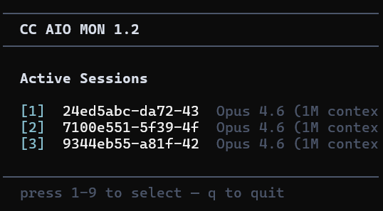
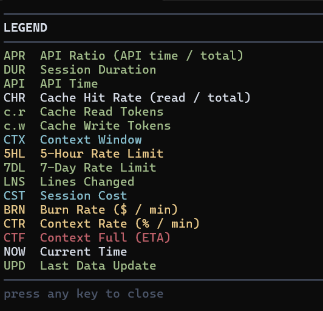

# CC AIO MON

  

**Real-time terminal monitor for Claude Code** — context window, API rate limits, session costs, and burn rate. Zero dependencies, single-file Python, cross-platform.



*Claude Code with statusline (left) + fullscreen TUI dashboard (right)*

### How is this different?

| Project | Approach | Limitation |
|---------|----------|------------|
| claude-monitor | Reads JSONL cost logs | Estimated data, not real-time |
| ccusage | CLI usage aggregator | Historical only, no live dashboard |
| ccstatusline | Status line script | No TUI, no multi-session |
| **CC AIO MON** | Official statusline JSON | Real-time, zero deps, most compact |

<details>
<summary>More screenshots</summary>
<br>



*Statusline — single line below Claude Code input, text-only format*



*Claude Code with statusline (left) + compact dashboard (right)*



*Dashboard — compact view with all metrics*



*Dashboard — full view with expanded sections*



*Session picker — shown on launch when multiple sessions detected*



*Legend overlay — toggle with `l` key*

</details>

## Quick Start

**1. Download**

```bash
git clone https://github.com/iM3SK/cc-aio-mon.git
```

**2. Configure statusline** — add to `~/.claude/settings.json`:

```json
{
  "statusLine": {
    "type": "command",
    "command": "python \"/path/to/cc-aio-mon/statusline.py\""
  }
}
```

On Windows, use forward slashes: `"python \"C:/path/to/statusline.py\""`

**3. Launch the dashboard**

```bash
python cc-aio-mon/monitor.py
```

Two files, zero dependencies, no install step. Optionally add a shell alias: `alias mon='python /path/to/monitor.py'`

## Features

- **Most compact monitor** — all critical metrics in one screen. No scrolling, no tabs, no wasted space.
- **Zero dependencies** — stdlib-only Python. No pip install, no venv, no node_modules.
- **Two-tier architecture** — lightweight statusline (updates on each Claude Code event) + fullscreen TUI dashboard.
- **Real-time metrics** — context window with token counts, API ratio, 5-hour and 7-day rate limits, cost, burn rate, context full ETA.
- **Cross-platform** — Windows (Terminal, PowerShell, Git Bash), macOS (Terminal, iTerm2), Linux.
- **Nord color palette** — truecolor ANSI output with consistent color-coded sections.
- **Responsive layout** — statusline drops segments to fit narrow terminals. Dashboard adapts to any terminal size.
- **Multi-session support** — auto-detects active sessions. Numbered picker when multiple sessions are running. Session switching available anytime via `s` key.
- **Stale detection** — session data older than 30 minutes dims all metrics and shows inactive duration in the session status line. Last known values remain visible.
- **Security hardened** — path traversal prevention, escape injection protection, atomic file reads/writes, file size limits.

## Usage

### Statusline

Runs automatically on each Claude Code status update. Outputs a single colored line below the input area with Nord bar background that extends to full terminal width. Left side: model, API ratio, context %, cache hit rate, rate limits. Right side: burn rate, context rate, context full ETA, cost, duration, clock. Right segments drop when the terminal is narrow.

### Dashboard

```bash
python monitor.py              # auto-detect session
python monitor.py --session ID # specific session
python monitor.py --list       # list active sessions
python monitor.py --refresh 1000  # custom refresh interval (ms, default 500)
```

### Session Picker

The session picker is shown on launch when multiple sessions are available or accessible anytime by pressing `s`. Press `1-20` to select a session. The picker lists both live and stale sessions — sessions marked `(stale)` haven't received updates in over 30 minutes. With a single active session, the monitor connects automatically without showing the picker.

### Keyboard Shortcuts

| Key | Action |
|-----|--------|
| `q` | Quit |
| `r` | Force refresh data (resets stale timer) |
| `l` | Toggle legend overlay |
| `s` | Switch session (return to picker) |
| `1-20` | Select session (picker) |

## Metrics Reference

### Statusline Segments

Left-aligned (always visible):

| Code | Color | Metric |
|------|-------|--------|
| (model) | white | Model display name |
| APR | green | API Ratio — time in API calls vs total session duration |
| CTX | cyan | Context Window — percentage and token count (used/total) |
| CHR | green | Cache Hit Rate — cache reads vs total cache operations |
| 5HL | dynamic | 5-Hour Rate Limit — green/yellow/red by usage % |
| 7DL | dynamic | 7-Day Rate Limit — green/yellow/red by usage % |

Right-aligned (dropped from right when terminal is narrow):

| Code | Color | Metric |
|------|-------|--------|
| BRN | orange | Cost burn rate ($/min) |
| CTR | yellow | Context consumption rate (% / min) |
| CTF | red | Context Full ETA — predicted time to 100% |
| CST | orange | Total session cost (USD) |
| DUR | dim | Session duration |
| NOW | dim | Current local time |

### Dashboard Metrics

| Code | Color | Metric |
|------|-------|--------|
| APR | green | API Ratio — time in API calls vs total session duration |
| DUR | dim | Session duration (sub-stat under APR) |
| API | dim | API time (sub-stat under APR) |
| CHR | green | Cache Hit Rate — cache reads vs total cache operations |
| c.r | green | Cache read tokens (sub-stat under CHR) |
| c.w | green | Cache write tokens (sub-stat under CHR) |
| CTX | cyan | Context Window — percentage and token count (used/total) |
| 5HL | dynamic | 5-Hour Rate Limit — green/yellow/red by usage % |
| 7DL | dynamic | 7-Day Rate Limit — green/yellow/red by usage % |
| LNS | dim | Lines added (green) / removed (red) in session |
| CST | orange | Total session cost (USD) |
| BRN | orange | Cost burn rate ($/min) |
| CTR | yellow | Context consumption rate (%/min) |
| CTF | red | Context Full ETA — predicted time to 100% |
| NOW | dim | Current local time |
| UPD | dim | Time since last data update |

### Color Thresholds

All progress bars use the same thresholds:

- **Green** (< 50%) — healthy, plenty of headroom
- **Yellow** (50-79%) — approaching limits
- **Red** (>= 80%) — critical, take action

## Configuration

| Variable | Default | Description |
|----------|---------|-------------|
| `CLAUDE_STATUS_WARN` | `50` | Yellow threshold (%) |
| `CLAUDE_STATUS_CRIT` | `80` | Red threshold (%) |

```bash
export CLAUDE_STATUS_WARN=60
export CLAUDE_STATUS_CRIT=90
```

## How It Works

```
Claude Code ──stdin──> statusline.py ──> terminal (one-line status)
                            |
                            v
                    $TMPDIR/claude-aio-monitor/
                    ├── {session_id}.json    (current state, atomic write)
                    └── {session_id}.jsonl   (timestamped history)
                            |
                            v
                      monitor.py ──> terminal (fullscreen TUI)
```

1. **statusline.py** receives JSON from Claude Code via stdin on each status update.
2. Outputs a colored one-line summary to the terminal.
3. Writes session state atomically to a temp directory for the monitor.
4. Appends timestamped entries to a JSONL history file for burn rate calculation.
5. **monitor.py** polls the temp directory, renders a fullscreen dashboard with bars, stats, and computed metrics.

<details>
<summary>IPC and security details</summary>

### IPC Details

- State files: atomic write via `NamedTemporaryFile` + `os.replace()` (no partial reads)
- History: append-only JSONL written only after the snapshot write succeeds — keeps `.json` and `.jsonl` in sync; auto-trimmed when file exceeds 1 MB (keeps last 1000 entries)
- Stale `.tmp` files older than 60 seconds cleaned up automatically
- Session detection: files older than 30 minutes marked as stale — all metrics dimmed (last known values preserved), header shows `STALE`

### Security

| Measure | Protection |
|---------|------------|
| Session ID validation | Strict regex `[a-zA-Z0-9_-]{1,128}` prevents path traversal |
| Input sanitization | C0 and C1 control characters (`\x00–\x1f`, `\x7f–\x9f`) stripped from all JSON fields before terminal output |
| File size limits | JSON capped at 1 MB, JSONL at 10 MB — oversized files skipped |
| Atomic writes | Unpredictable temp filenames prevent symlink attacks |
| TOCTOU prevention | File reads use single open + bounded read instead of separate stat + read |
| Directory permissions | Temp directory created with `0o700` where supported |
| Graceful shutdown | SIGTERM handler + atexit ensure terminal state is always restored |
| Render isolation | Corrupted data caught per-frame — does not crash the TUI |

</details>

## Requirements

- **Python 3.8+** (stdlib only — no pip install needed)
- **Claude Code** with statusline support
- **Terminal with truecolor** — Windows Terminal, iTerm2, Alacritty, Kitty, most modern terminals
- **80 columns** minimum recommended

## Troubleshooting

**Monitor shows "Waiting for Claude Code session..."**
- Ensure Claude Code is running with an active session.
- Check that `statusLine.command` is configured in `~/.claude/settings.json`.
- Verify temp files exist: `%TEMP%/claude-aio-monitor/` (Windows) or `/tmp/claude-aio-monitor/` (macOS/Linux).

**Statusline not appearing**
- Verify the path in `statusLine.command` is correct and uses forward slashes.
- Test manually: `echo '{"context_window": {"used_percentage": 42}}' | python statusline.py`

**Raw escape codes visible / characters scrolling down the screen**
- Your terminal does not support ANSI escape sequences. The monitor now detects this on startup and exits with an error instead of rendering garbled output.
- Use a terminal with ANSI support: **Windows Terminal**, iTerm2, xterm, Kitty, Alacritty, or any modern terminal emulator.
- Terminals known to cause this: standalone `cmd.exe`, some older PowerShell console windows, any terminal with `TERM=dumb`.
- Quick test: `python -c "print('\033[32mGREEN\033[0m')"` — if you see `[32mGREEN[0m` instead of colored text, your terminal lacks ANSI support.

**Garbled output / encoding errors on Windows**
- Run `chcp 65001` in your terminal for UTF-8 mode.
- Both scripts auto-detect and override stdout encoding, but the terminal must support UTF-8 fonts.

**Monitor not responding to keyboard**
- On Windows, the terminal window must have focus for `msvcrt.getch()` to work.
- Press `q` to quit, `Ctrl+C` as fallback.

## Contributing

Contributions welcome. Keep zero-dependency (stdlib only), keep single-file (`statusline.py` and `monitor.py` self-contained), test on Windows and at least one Unix platform. Run `python -c "import py_compile; py_compile.compile('statusline.py', doraise=True); py_compile.compile('monitor.py', doraise=True)"` before submitting.

## License

MIT License. See [LICENSE](LICENSE) for details.

---

[Changelog](CHANGELOG.md)
