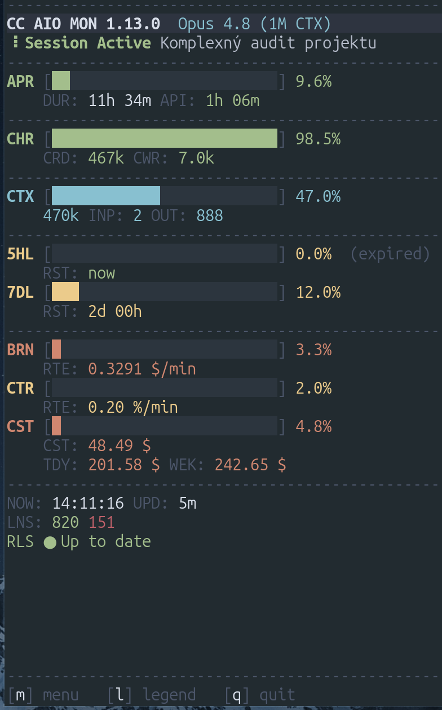
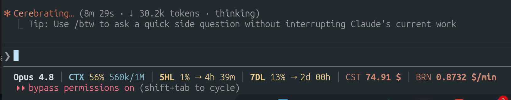
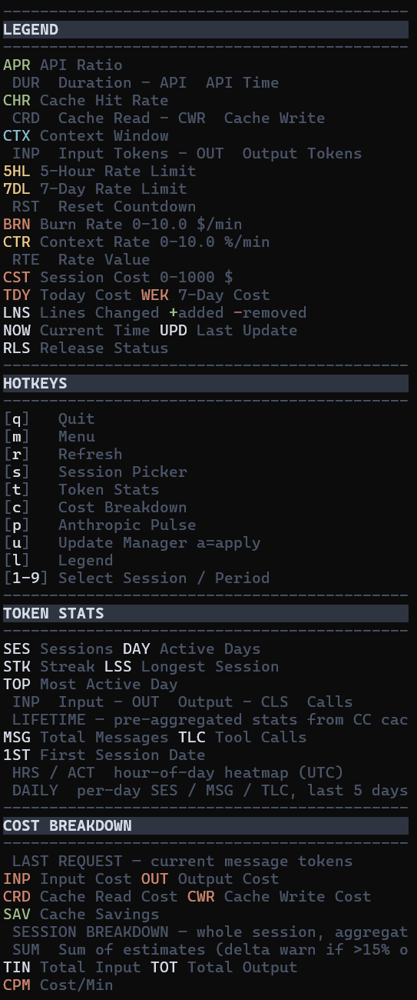
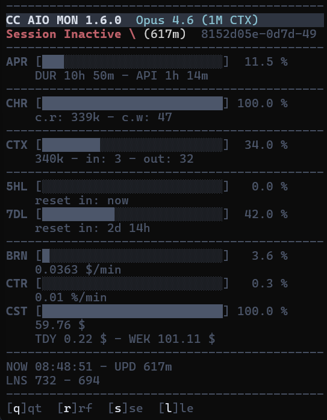

# CC AIO MON — Claude Code Terminal Monitor

      

**Real-time terminal monitor for Claude Code CLI.** Track context window usage, API rate limits, session costs, burn rate, and cache performance — all in one compact TUI dashboard. Stdlib only (Python 3.8+), cross-platform.

> **How it works:** Claude Code pipes session telemetry as JSON to `statusline.py` via **stdin** after each assistant message, permission mode change, or vim mode toggle (300ms debounce). The script parses the JSON, renders a one-line ANSI status bar in the terminal, and writes the data to `$TMPDIR/claude-aio-monitor/` as atomic JSON snapshots + append-only JSONL history. A separate `monitor.py` process polls these temp files and renders a fullscreen TUI dashboard. Both scripts share `shared.py` for burn rate ($/min) and context rate (%/min) calculation. **Four Python files, stdlib only, no build step.**

| | |
|---|---|
| **Input** | Claude Code `statusLine` JSON protocol via stdin — model info, context window, rate limits, cost, token counts, session metadata |
| **Output** | ANSI truecolor terminal — 4-line statusline bar + fullscreen TUI dashboard with progress bars, smart alerts, cross-session cost aggregation |
| **Data flow** | `Claude Code → stdin JSON → statusline.py → temp files → monitor.py → TUI` |
| **Files** | `statusline.py` (statusline renderer + IPC writer), `monitor.py` (TUI dashboard), `shared.py` (shared helpers + rate math), `update.py` (self-updater) |
| **IPC** | Atomic JSON snapshots + JSONL history in `$TMPDIR/claude-aio-monitor/` — no sockets, no databases |

<p align="center"></p>

## Why CC AIO MON?

| Project | Data source | Limitation |
|---------|-------------|------------|
| claude-monitor | Reads JSONL cost logs | Estimated data, not real-time |
| ccusage | CLI usage aggregator | Historical only, no live view |
| ccstatusline | Status line script | No TUI, no multi-session |
| **CC AIO MON** | **Official stdin JSON protocol** | **Real-time, stdlib only, most complete** |

Other monitors scrape log files or estimate costs from token counts. CC AIO MON reads the **official Claude Code statusline JSON** — the same data Claude Code uses internally. No estimation, no guessing, no stale logs.

<p align="center"></p>

<p align="center"></p>

## Setup

| Platform | Guide |
|----------|-------|
| [Windows](docs/setup-windows.md) | Python Launcher (`py`), Windows Terminal, PowerShell |
| [macOS](docs/setup-macos.md) | python3, Terminal.app or iTerm2 |
| [Linux](docs/setup-linux.md) | python3, any truecolor terminal |

## Features

- **Compact** — all critical metrics in one screen. No scrolling, no tabs, no wasted space.
- **Stdlib only** — Python 3.8+. No pip install, no venv, no node_modules.
- **Simple setup** — clone the repo, add one block to `~/.claude/settings.json`, launch the monitor. See [platform setup guide](#setup).
- **Official stdin JSON** — reads Claude Code's `statusLine` JSON protocol via stdin. No log scraping, no file watching, no API polling. Real data, real-time.
- **Two-tier architecture** — `statusline.py` (4-line status bar with left/right layout, triggered per Claude Code event) + `monitor.py` (fullscreen TUI, polls temp files independently).
- **Temp file IPC** — atomic JSON snapshots + JSONL history in `$TMPDIR/claude-aio-monitor/`. No sockets, no databases, no shared memory. Works across terminal sessions.
- **Progress bars with fixed ranges** — BRN (0-1.0 $/min), CTR (0-5.0 %/min), CST (0-$50) plus standard 0-100% bars for APR, CHR, CTX, 5HL, 7DL.
- **Smart warnings** — header alerts when context fills in < 30 min or burn rate exceeds threshold. Rate limits use colored bars (red at ≥ 80%).
- **Cross-session cost tracking** — TDY (today) and WEK (rolling 7-day) aggregate cost across all active Claude Code sessions.
- **Token usage stats** — press `t` for a per-model token breakdown (In/Out/Calls), session count, active days, streaks, longest session, and most active day. Reads `~/.claude/projects/` transcripts. Filterable by All Time / Last 7 Days / Last 30 Days.
- **Update manager** — press `u` to check for updates. Shows current vs remote version, new commits, changelog preview, and safety warnings. Press `a` to apply.
- **Cross-platform** — Windows (Terminal, PowerShell, Git Bash), macOS (Terminal, iTerm2), Linux. CI-tested: Ubuntu (Python 3.8 + 3.12), Windows (Python 3.12). macOS: not CI-tested.
- **Nord truecolor palette** — ANSI 24-bit color with semantic grouping: green = performance, cyan = context, yellow = rate limits, orange = cost/finance, red = critical.
- **Responsive layout** — statusline drops right segments for narrow terminals. Dashboard compresses sections automatically.
- **Multi-session** — auto-detects sessions via temp files. Numbered picker for multiple sessions. Press `s` to switch anytime.
- **Stale detection** — sessions idle > 30 minutes get dimmed metrics with last known values preserved. See [Session States](#session-states) for a visual example.
- **Release check (RLS)** — background version check against GitHub once per hour. Shows green "up to date" or blinking red "update available" in the dashboard. Disable with `CC_AIO_MON_NO_UPDATE_CHECK=1`.
- **Security hardened** — session ID regex validation (`[a-zA-Z0-9_-]{1,128}`), C0/C1 control character sanitization, atomic writes via `NamedTemporaryFile`, file size limits (1MB JSON, 10MB JSONL).

## Session States

The dashboard distinguishes **active** and **inactive** sessions. An active session receives fresh JSON snapshots from `statusline.py` on every Claude Code event. When no update arrives for more than 30 minutes, `monitor.py` marks the session as stale: the header switches to `Session Inactive`, the time-since-last-update is shown in parentheses (e.g. `(617m)`), and every metric is rendered in the dimmed variant of its color. Last known values are preserved — nothing is zeroed out — so you can still see where the session left off (context used, cost accumulated, rate-limit buckets, burn rate at time of freeze).

<p align="center"></p>

Press `r` to force a refresh (resets the stale timer if new data has arrived), or `s` to switch to a different session from the picker. If the session has truly ended and you want it out of the picker, delete its JSON/JSONL pair from `$TMPDIR/claude-aio-monitor/`.

## Metrics at a Glance

| Metric | What it shows | Range | Where |
|--------|--------------|-------|-------|
| **APR** | API time / total session time | 0-100% | statusline + dashboard |
| **CHR** | Cache read tokens / total cache | 0-100% | statusline + dashboard |
| **CTX** | Context window usage | 0-100% | statusline + dashboard |
| **5HL** | 5-hour rate limit usage | 0-100% | statusline + dashboard |
| **7DL** | 7-day rate limit usage | 0-100% | statusline + dashboard |
| **BRN** | Cost burn rate | 0-1.0 $/min | statusline + dashboard |
| **CTR** | Context consumption rate | 0-5.0 %/min | statusline + dashboard |
| **CST** | Session cost | 0-$50 | statusline + dashboard |
| **TDY** | Today's cost (all sessions) | — | dashboard |
| **WEK** | Rolling 7-day cost (all sessions) | — | dashboard |
| **CTF** | Context full ETA | HH:MM | statusline (dashboard: warning only) |
| **LNS** | Lines added / removed | — | dashboard |
| **DUR** | Session duration | — | statusline |
| **NOW** | Current clock time | HH:MM:SS | statusline + dashboard |
| **UPD** | Last data update age | — | dashboard |
| **RLS** | Release status (up to date / update available) | — | dashboard |
| **SES** | Total sessions | — | usage stats modal |
| **DAY** | Active days | — | usage stats modal |
| **STK** | Streak (current/best) | — | usage stats modal |
| **LSS** | Longest session | — | usage stats modal |
| **TOP** | Most active day | — | usage stats modal |

## Usage

### Statusline

Runs automatically on each Claude Code status update via stdin JSON. Outputs a single ANSI-colored line with Nord bar background. Left side: model, APR, CTX, CHR, 5HL, 7DL. Right side: BRN, CTR, CTF, CST, DUR, NOW. Right segments drop when terminal is narrow.

### Dashboard

> On macOS/Linux use `python3`. On Windows use `py`.

```bash
python3 monitor.py              # auto-detect session
python3 monitor.py --session ID # specific session
python3 monitor.py --list       # list active sessions
python3 monitor.py --refresh 1000  # custom refresh interval (ms, default 500)
```

### Keyboard Shortcuts

| Key | Action |
|-----|--------|
| `q` | Quit |
| `r` | Force refresh (resets stale timer) |
| `s` | Switch session (picker) |
| `t` | Token usage stats (per-model breakdown) |
| `u` | Update manager (version check, changelog, apply) |
| `l` | Toggle legend overlay |
| `1-9` | Select session (picker) |
| `1/2/3` | Switch period in token usage stats (all/7d/30d) |

### Session Picker

Shown on launch when multiple session files exist. Press `1-9` to select. Lists both live and stale sessions. With exactly one session file (active, not stale), connects automatically.

## How It Works

```
Claude Code ──stdin JSON──> statusline.py ──> terminal (4-line ANSI status bar)
                                 |
                                 v
                         $TMPDIR/claude-aio-monitor/        (macOS/Linux: /tmp | Windows: %TEMP%)
                         ├── {session_id}.json    (atomic snapshot)
                         └── {session_id}.jsonl   (append-only history)
                                 |
                                 v
                           monitor.py ──> terminal (fullscreen TUI)

Both scripts import shared.py for shared BRN/CTR calculation.
```

1. **Claude Code** emits JSON telemetry to `statusline.py` via stdin after each assistant message, permission mode change, or vim mode toggle (300ms debounce).
2. **statusline.py** parses JSON, renders 4-line ANSI status bar (model, rate limits, costs, release status), writes atomic snapshot (`.json`) + appends to history (`.jsonl`).
3. **monitor.py** polls temp directory (default 500ms), reads snapshots + history, renders fullscreen TUI with progress bars and computed metrics.
4. **shared.py** provides `calc_rates()` — computes BRN ($/min) and CTR (%/min) from JSONL history timestamps.

### Color Thresholds

| Range | Color | Meaning |
|-------|-------|---------|
| < 50% | Green | Healthy |
| 50-79% | Yellow | Approaching limits |
| >= 80% | Red | Critical |

Exception: 5HL/7DL labels use yellow as base color (even below 50%) to visually distinguish rate limits from performance metrics.

## Configuration

| Variable | Default | Scope | Description |
|----------|---------|-------|-------------|
| `CLAUDE_STATUS_WARN` | `50` | statusline | Yellow threshold (%) |
| `CLAUDE_STATUS_CRIT` | `80` | statusline | Red threshold (%) |
| `CLAUDE_WARN_BRN` | `0.50` | dashboard | Burn rate warning threshold ($/min) |
| `CC_AIO_MON_NO_UPDATE_CHECK` | *(unset)* | dashboard | Set to `1` to disable background release check |

```bash
export CLAUDE_STATUS_WARN=60
export CLAUDE_STATUS_CRIT=90
```

<details>
<summary>IPC and security details</summary>

### IPC Details

- State files: atomic write via `NamedTemporaryFile` + `os.replace()` (no partial reads)
- History: append-only JSONL, written only after snapshot succeeds — keeps `.json` and `.jsonl` in sync
- Auto-trimmed when file exceeds 1 MB (keeps last 1000 entries)
- Stale `.tmp` files older than 60 seconds cleaned up automatically
- Session detection: files older than 30 minutes marked as stale — metrics dimmed, `Session Inactive \ (Nm)` header shown with minutes-since-last-update, last known values preserved (see [Session States](#session-states))

### Security

| Measure | Protection |
|---------|------------|
| Session ID validation | Strict regex `[a-zA-Z0-9_-]{1,128}` prevents path traversal |
| Input sanitization | C0/C1 control characters stripped from string fields before terminal output |
| File size limits | JSON capped at 1 MB, JSONL at 10 MB — oversized files skipped |
| Atomic writes | Unpredictable temp filenames prevent symlink attacks |
| TOCTOU prevention | Single open + bounded read instead of separate stat + read |
| Directory permissions | Temp directory created with `0o700` where supported |
| Graceful shutdown | SIGTERM handler + atexit restore terminal state |
| Render isolation | Corrupted data caught per-frame — TUI never crashes |

</details>

## Requirements

- **Python 3.8+**
  - macOS / Linux: usually pre-installed (`python3 --version` to verify)
  - Windows: must be installed separately (not bundled with Windows)
  - No pip packages needed — stdlib only. See [platform setup guide](#setup).
- **Claude Code CLI** with statusline support
- **Truecolor terminal** — Windows Terminal, iTerm2, Alacritty, Kitty, or any terminal supporting ANSI 24-bit color
- **80 columns** minimum recommended

## Troubleshooting

Platform-specific troubleshooting is in the setup guides:

- [Windows — Troubleshooting](docs/setup-windows.md#troubleshooting)
- [macOS — Troubleshooting](docs/setup-macos.md#troubleshooting)
- [Linux — Troubleshooting](docs/setup-linux.md#troubleshooting)

## Updating

**Recommended:** use the bundled `update.py` script — it safely checks for updates, previews changes, and applies them:

```bash
# macOS / Linux
cd ~/.cc-aio-mon
python3 update.py             # check only (no changes)
python3 update.py --apply     # check + git pull
```

```powershell
# Windows (PowerShell)
cd "$env:USERPROFILE\.cc-aio-mon"
py update.py                  # check only (no changes)
py update.py --apply          # check + git pull
```

The script is **read-only by default** — it shows you what would change (version, new commits, CHANGELOG preview) and only pulls when you add `--apply`. It aborts safely if your working tree is dirty, you're on a different branch, or history has diverged.

**Manual fallback** — if you prefer plain git:

```bash
# macOS / Linux
git -C ~/.cc-aio-mon pull

# Windows (PowerShell)
git -C "$env:USERPROFILE\.cc-aio-mon" pull
```

The path in `settings.json` does not change between versions — `git pull` updates the project source, and Claude Code picks up the new code on the next session. No changes to `settings.json` needed.

After updating, restart Claude Code to pick up the new statusline. Optionally re-run `check-requirements.ps1` / `check-requirements.sh` from the repo directory to verify system requirements still pass.

## Contributing

Contributions welcome. Keep it stdlib only, ship `shared.py` alongside entry scripts, test on Windows and Unix. Before submitting, run the test suite and the compile check (`python3` on macOS/Linux, `py` on Windows):

```bash
python3 tests.py
python3 -c "import py_compile; [py_compile.compile(f, doraise=True) for f in ('shared.py','statusline.py','monitor.py','update.py')]"
```

Open an issue first for anything non-trivial so the approach can be discussed before work begins. See [`CONTRIBUTING.md`](CONTRIBUTING.md) for full guidelines.

## License

MIT License. See [LICENSE](LICENSE) for details.

---

[Changelog](CHANGELOG.md)
