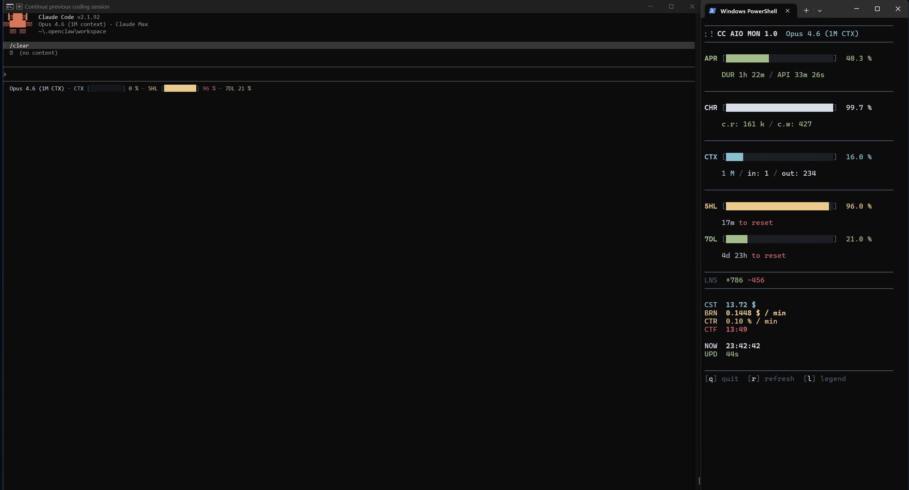

# CC AIO MON

   

**Real-time terminal dashboard for Claude Code** — monitor context window usage, API rate limits, session costs, and burn rate directly in your terminal. Zero dependencies, single-file Python, cross-platform.

> The most compact Claude Code monitor available — all critical metrics in a single terminal window. Track token usage, spending, and rate limits at a glance. Know exactly when your context window fills up, how fast you're burning through your quota, and what each session costs — all without leaving the terminal.



*Statusline integrated in Claude Code (left) + fullscreen TUI dashboard (right)*

<details>
<summary>More screenshots</summary>
<br>


*Statusline — compact one-line status below Claude Code input*

 

*Dashboard — compact view (left) vs full view with all metrics (right)*


*Legend overlay — toggle with `l` key*

</details>

## Quick Start

```bash
# 1. Download
git clone https://github.com/iM3SK/cc-aio-mon.git

# 2. Configure Claude Code statusline
# Add to ~/.claude/settings.json:
#   "statusLine": {"type": "command", "command": "python \"/path/to/statusline.py\""}

# 3. Launch the dashboard
python monitor.py
```

That's it. Two files, zero dependencies, no install step.

## Table of Contents

- [Why CC AIO MON?](#why-cc-aio-mon)
- [Features](#features)
- [Installation](#installation)
- [Usage](#usage)
- [Metrics Reference](#metrics-reference)
- [Configuration](#configuration)
- [How It Works](#how-it-works)
- [Requirements](#requirements)
- [Troubleshooting](#troubleshooting)
- [Alternatives](#alternatives)
- [Contributing](#contributing)
- [Changelog](#changelog)

## Why CC AIO MON?

Claude Code is powerful but opaque about resource consumption. You can't see how much context you've used, how close you are to rate limits, or what a session costs — until it's too late. CC AIO MON solves this with the **most information-dense layout** of any Claude Code monitor — every metric visible at once, no scrolling, no tabs, no wasted space:

- **Context window filling up?** See exactly how much is used, the fill rate, and an ETA to 100%.
- **Rate limited?** Track 5-hour and 7-day quota consumption with countdown to reset.
- **Expensive session?** Watch real-time cost and burn rate ($ per minute).
- **Cache working?** Monitor cache hit rate to verify your prompts are being cached effectively.
- **Multiple sessions?** Auto-detect and switch between active Claude Code sessions.

## Features

- **Most compact monitor** — 16 metrics in one screen. No scrolling, no tabs, no wasted space. Everything visible at a glance, even in a small terminal window.
- **Zero dependencies** — stdlib-only Python. No pip install, no venv, no node_modules. Just copy and run.
- **Two-tier architecture** — lightweight statusline (runs on each Claude Code update) + fullscreen TUI dashboard for deep monitoring.
- **Real-time metrics** — context window, API ratio, cache hit rate, 5-hour and 7-day rate limits, cost, burn rate, context full ETA.
- **Cross-platform** — Windows (Terminal, PowerShell, Git Bash), macOS (Terminal, iTerm2), Linux. Auto-detects platform for keyboard input.
- **Nord color palette** — truecolor ANSI output with consistent color-coded sections. Clean separator lines, no box-drawing clutter.
- **Responsive layout** — statusline drops segments to fit narrow terminals. Monitor adapts smoothly to any terminal size with ANSI-aware line truncation.
- **Multi-session support** — auto-detects active sessions. Numbered picker when multiple sessions are running.
- **Animated spinner** — dots12 braille animation in dashboard header shows the monitor is alive.
- **Security hardened** — path traversal prevention, terminal escape injection protection, atomic file writes, file size limits.

## Installation

### 1. Download

```bash
git clone https://github.com/iM3SK/cc-aio-mon.git
cd cc-aio-mon
```

Or just download the two files — `statusline.py` and `monitor.py`. That's it.

### 2. Configure Claude Code

Add the statusline command to `~/.claude/settings.json`:

```json
{
  "statusLine": {
    "type": "command",
    "command": "python \"/path/to/statusline.py\""
  }
}
```

On Windows use forward slashes:

```json
{
  "statusLine": {
    "type": "command",
    "command": "python \"C:/Users/you/cc-aio-mon/statusline.py\""
  }
}
```

### 3. (Optional) Shell alias

```bash
alias mon='python /path/to/monitor.py'
```

## Usage

### Statusline

Runs automatically on each Claude Code status update. Outputs a single colored line below the input area. Segments drop from right when the terminal is narrow.

### Monitor

```bash
python monitor.py              # auto-detect session
python monitor.py --session ID # specific session
python monitor.py --list       # list active sessions
python monitor.py --refresh 1000  # custom refresh interval (ms, default 500)
```

### Keyboard Shortcuts

| Key | Action |
|-----|--------|
| `q` | Quit |
| `r` | Force refresh data |
| `l` | Toggle legend overlay |
| `1-9` | Select session (picker) |

## Metrics Reference

### Progress Bars

| Code | Color | Metric |
|------|-------|--------|
| APR | green | API Ratio — time spent in API calls vs total session duration |
| CHR | white | Cache Hit Rate — cache reads vs total cache operations |
| CTX | cyan | Context Window — percentage of token limit consumed |
| 5HL | yellow | 5-Hour Rate Limit — quota consumed in current 5-hour window |
| 7DL | green | 7-Day Rate Limit — quota consumed in current 7-day window |

### Stats

| Code | Color | Metric |
|------|-------|--------|
| LNS | green/red | Lines added / removed in session |
| CST | cyan | Total session cost (USD) |
| BRN | yellow | Cost burn rate ($ / min) — computed from session history |
| CTR | yellow | Context consumption rate (% / min) |
| CTF | red | Context Full ETA — predicted time when context hits 100% |
| NOW | white | Current local time |
| UPD | green | Time since last data update from Claude Code |

### Color Thresholds

All progress bars use the same thresholds:

- **Green** (< 50%) — healthy, plenty of headroom
- **Yellow** (50-79%) — approaching limits, be aware
- **Red** (>= 80%) — critical, take action soon

## Configuration

### Environment Variables

| Variable | Default | Description |
|----------|---------|-------------|
| `CLAUDE_STATUS_WARN` | `50` | Yellow threshold percentage |
| `CLAUDE_STATUS_CRIT` | `80` | Red threshold percentage |

```bash
export CLAUDE_STATUS_WARN=60
export CLAUDE_STATUS_CRIT=90
```

## How It Works

### Architecture

```
Claude Code ──stdin──▶ statusline.py ──▶ terminal (one-line status)
                            │
                            ▼
                    %TEMP%/claude-aio-monitor/
                    ├── {session_id}.json    (current state, atomic write)
                    └── {session_id}.jsonl   (timestamped history)
                            │
                            ▼
                      monitor.py ──▶ terminal (fullscreen TUI)
```

1. **statusline.py** receives JSON from Claude Code via stdin on each status update.
2. Outputs a colored one-line summary to the terminal.
3. Writes session state atomically to a temp directory for the monitor.
4. Appends timestamped entries to a JSONL history file for burn rate calculation.
5. **monitor.py** polls the temp directory, renders a fullscreen dashboard with bars, stats, and computed metrics.

### IPC Details

- State files: atomic write via `NamedTemporaryFile` + `os.replace()` (no partial reads)
- History: append-only JSONL, auto-trimmed when file exceeds 1 MB (keeps last 1000 entries)
- Stale `.tmp` files older than 60 seconds cleaned up automatically
- Session detection: files older than 5 minutes marked as stale

### Security

| Measure | Protection |
|---------|------------|
| Session ID validation | Strict regex `[a-zA-Z0-9_-]{1,128}` prevents path traversal |
| Input sanitization | Control characters stripped from all JSON data fields before terminal output |
| File size limits | JSON capped at 1 MB, JSONL at 10 MB — oversized files skipped |
| Atomic writes | Unpredictable temp filenames prevent symlink/TOCTOU attacks |
| Directory permissions | Temp directory created with `0o700` where supported |
| Graceful shutdown | SIGTERM handler + atexit ensure terminal state is always restored |
| Render isolation | Corrupted data caught per-frame — does not crash the TUI |

### Responsive Layout

- Separator lines span full terminal width
- All content lines truncated to terminal width (ANSI-aware, preserves escape codes)
- 50ms tick loop for responsive resize detection
- Smooth shrink: spacing between sections compresses first, then bottom sections clip
- Top content always stays stable during resize

## Requirements

- **Python 3.8+** (stdlib only — no pip install needed)
- **Claude Code** with statusline support
- **Terminal with truecolor** — Windows Terminal, iTerm2, Alacritty, Kitty, most modern terminals
- **80 columns** minimum recommended

## Troubleshooting

**Monitor shows "Waiting for Claude Code session..."**
- Ensure Claude Code is running with an active session.
- Check that `statusLine.command` is configured in `~/.claude/settings.json`.
- Verify temp files exist: check `%TEMP%/claude-aio-monitor/` (Windows) or `/tmp/claude-aio-monitor/` (macOS/Linux).

**Statusline not appearing**
- Verify the path in `statusLine.command` is correct and uses forward slashes.
- Test manually: `echo '{"context_window": {"used_percentage": 42}}' | python statusline.py`

**Garbled output / encoding errors on Windows**
- Run `chcp 65001` in your terminal for UTF-8 mode.
- Both scripts auto-detect and override stdout encoding, but the terminal must support UTF-8 fonts.

**Monitor not responding to keyboard**
- On Windows, the terminal window must have focus for `msvcrt.getch()` to work.
- Press `q` to quit, `Ctrl+C` as fallback.

## Alternatives

| Project | Approach | Limitation |
|---------|----------|------------|
| claude-monitor | Reads JSONL cost logs | Estimated data, not real-time |
| ccusage | CLI usage aggregator | Historical only, no live dashboard |
| ccstatusline | Status line script | No TUI, no multi-session |
| **CC AIO MON** | Official statusline JSON | Real-time, zero deps, most compact |

CC AIO MON is the **most compact** and **most complete** Claude Code monitor available. It's the only tool that uses Claude Code's official status line protocol for precise, real-time session data — not estimates from log files. All 16 metrics fit in a single terminal window without scrolling.

## Contributing

Contributions welcome. Please:

1. Keep zero-dependency — stdlib only, no pip packages.
2. Keep single-file — `statusline.py` and `monitor.py` should remain self-contained.
3. Test on Windows and at least one Unix platform.
4. Run `python -c "import py_compile; py_compile.compile('statusline.py', doraise=True); py_compile.compile('monitor.py', doraise=True)"` before submitting.

## License

MIT License. See [LICENSE](LICENSE) for details.

## Changelog

### v1.1 — 2026-04-07

**Security:**
- Path traversal prevention via session ID validation
- Terminal escape injection protection (control character sanitization)
- Atomic writes via unpredictable temp filenames (NamedTemporaryFile)
- File size limits on all JSON/JSONL reads
- SIGTERM handler for graceful terminal cleanup
- Temp directory created with restricted permissions (0o700)

**Bug fixes:**
- History trim now triggers on file size (was never firing due to per-process counter reset)
- Off-by-1 in statusline segment width calculation (seg_ctx, seg_5hl)
- Keyboard input (`q`, `r`, `l`) always responsive (polling moved before render check)
- Render errors caught per-frame (corrupted data no longer crashes TUI)

**Features:**
- dots12 braille spinner animation in dashboard header (56 frames, 50ms)
- Full-width separator lines (previously capped at 72 chars)
- ANSI-aware line truncation (prevents terminal overflow)
- Smooth resize with gradual section compression
- Stale .tmp file cleanup in session listing
- --refresh argument validated and clamped (100-60000ms)

**Cleanup:**
- Removed dead code (unused imports, variables, functions)
- Environment variable parsing with safe fallback defaults
- History file cached by mtime (no unnecessary reloads)

### v1.0 — 2026-04-07

- Initial release
- Statusline: Nord truecolor, 3-letter codes, enclosed bars, responsive segments
- Monitor: fullscreen TUI, 5 bar metrics (APR/CHR/CTX/5HL/7DL), stats, legend overlay
- Responsive resize with 50ms tick, empty line trimming
- IPC via atomic JSON + JSONL history, burn rate calculation
- Zero dependencies, cross-platform (Windows/macOS/Linux)
