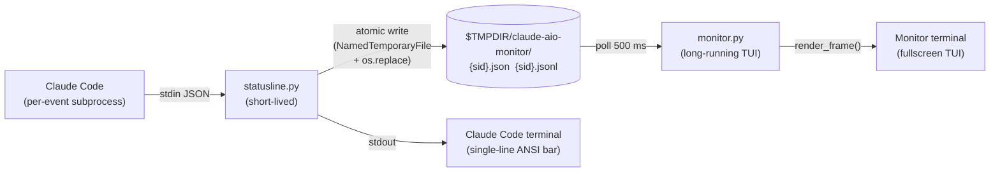

# CC AIO MON — Architecture Overview

> v1.15.3 · Target reader: new contributor who just cloned the repo.
> Goal: understand "where is what and how do things relate" in ~10 minutes.
> For the full feature reference see [README.md](../README.md).
> For the IPC field schema see [FILE-IPC-CONTRACT.md](FILE-IPC-CONTRACT.md).

---

## 1. Project Shape

**CC AIO MON is a real-time terminal monitor for Claude Code CLI.** It surfaces
context-window usage, API rate limits, session cost, burn rate, and cache
performance in a compact TUI dashboard. It is an independent community project —
not affiliated with Anthropic — and interacts with Claude Code exclusively
through the documented `statusLine` stdin hook and the user's own local files.

The project exists because every alternative either scrapes log files or
estimates from token counts. CC AIO MON reads the **official Claude Code
statusline JSON** — the same data Claude Code uses internally — so the numbers
are authoritative and real-time.

Design center: five runtime Python files, stdlib only, no build step, no pip
install. Python 3.8+ on Windows, macOS, and Linux.

---

## 2. Two Processes

The architecture is split into two independent OS processes with deliberately
separate lifecycles.

**statusline.py — short-lived, N instances**

Claude Code launches `statusline.py` as a subprocess on every statusline event
(each assistant message, permission mode change, or vim mode toggle, with a
300 ms debounce on Claude Code's side). The script reads one JSON payload from
stdin, renders one ANSI status line to stdout, writes the IPC files, and exits.
Multiple Claude Code sessions run simultaneously, each spawning their own
`statusline.py` instance writing to a different `{session_id}.json` file.
Claude Code owns this lifecycle entirely.

**monitor.py — long-lived, 1 instance**

The user launches `monitor.py` once in a separate terminal. It runs until the
user presses `q` or kills the process. It polls the IPC files at a 500 ms
data-refresh interval (50 ms tick for keyboard responsiveness) and renders a
fullscreen TUI dashboard. A singleton lock (`monitor.lock`, acquired via
`fcntl.flock` on Unix / `msvcrt.locking` on Windows, see `shared.acquire_singleton_lock`)
prevents two concurrent dashboard instances from racing the same files.

**Why split?** Claude Code can only hook into statusline.py (short-lived, per
event). A persistent TUI cannot live inside that subprocess. The temp-file IPC
lets both processes operate independently without sockets or shared memory.

---

## 3. Five Modules

**statusline.py** — Entry point 1. Reads Claude Code's statusline JSON from
stdin, renders the single-line ANSI status bar (Model, CTX, 5HL, 7DL, CST,
BRN segments), and writes the IPC snapshot + history via `write_shared_state()`.
Segment builders (`seg_model`, `seg_ctx`, `seg_5hl`, `seg_7dl`, `seg_cost`,
`seg_brn`) each return `(text, visible_length)` and are dropped from the right
by `build_line()` when the terminal is too narrow. On Windows, terminal width
is queried via `CONOUT$` because Claude Code runs this script with all file
descriptors piped (`_get_terminal_width`).

**monitor.py** — Entry point 2 (interactive TUI). ~3 740 LOC. Owns the event
loop, all `render_*` functions, the session picker, and the daemon worker
threads (see Section 5). The crash logger (`_install_crash_logger`) writes
uncaught exceptions to `monitor-crash.log` because the alt-screen buffer would
otherwise swallow any traceback silently. It is intentionally a single large module. The section index keeps the TUI navigable while preserving the five-runtime-file stdlib layout. The `test_debt016` maintainability trigger sits at 4000 LOC.

**pulse.py** — Daemon thread module. Fetches `status.claude.com/api/v2/summary.json`
and probes `api.anthropic.com/v1/messages` (any HTTP response counts as liveness).
Computes a weighted 0–100 stability score (`compute_score`), smoothed via
rolling median, and exposes the result via `get_pulse_snapshot()` (thread-safe
read). Started idempotently from `monitor.main()` via `start_pulse_worker()`.
Proxy env vars are scrubbed at import time: `pulse.py` builds a no-proxy opener
via `urllib.request.build_opener(urllib.request.ProxyHandler({}))` and stores it
in module-local `_OPENER`; all fetch calls use that opener so Pulse fetches
cannot be silently routed through an injected proxy.

**update.py** — Entry point 3 (CLI self-updater). Read-only by default; add
`--apply` to run `git pull --ff-only`. Guards: clean working tree, on `main`
branch, no divergence. Creates a `pre-update-YYYYMMDD-HHMMSS` rollback tag
before each pull. Runs `shared.check_syntax_after_pull()` on all five modules
after the pull to catch broken updates before the user restarts. In-app update
(`monitor.py` key `u` / `a`) uses the same shared logic (`_apply_update_worker`
daemon thread).

**shared.py** — The shared kernel. Single source of truth for: `VERSION`,
`SCHEMA_VERSION`, `PY_FILES`, `DATA_DIR`, ANSI color palette, `WARN_PCT` /
`CRIT_PCT` thresholds, `calc_rates()` (BRN/CTR computation from JSONL history),
`load_history()`, `safe_read()`, `is_safe_dir()`, `ensure_data_dir()`,
`run_git()` (minimal env whitelist), `acquire_singleton_lock()`,
`rotate_crash_log()`, `check_syntax_after_pull()`, and `parse_ahead_behind()`.
Imported by all four other modules; never run directly.

---

## 4. Data Flow

```
Claude Code
    │
    │  stdin JSON (one payload per event)
    ▼
statusline.py
    │
    ├─── stdout ──► single-line ANSI status bar (rendered in Claude Code's terminal)
    │
    └─── write_shared_state() ──► $TMPDIR/claude-aio-monitor/
                                        ├── {session_id}.json    (atomic snapshot)
                                        └── {session_id}.jsonl   (append-only history)
                                                │
                                                │  polled every 500 ms
                                                ▼
                                          monitor.py
                                                │
                                                └─── render_frame() ──► fullscreen TUI
```



The IPC contract: `statusline.write_shared_state()` serializes the full
Claude Code payload plus `_schema_version` (= `shared.SCHEMA_VERSION`, currently
`1`) and a Unix timestamp `t` into both the snapshot JSON and each JSONL history
line. The schema version field is advisory today (monitor reads all fields via
`dict.get()`) but exists to enable future non-backward-compatible changes.
The canonical field list lives in `shared.py` constants and the v1.12.0
CHANGELOG entry.

`$TMPDIR` resolves to `/tmp` on macOS/Linux and `%TEMP%` on Windows
(`pathlib.Path(tempfile.gettempdir()) / "claude-aio-monitor"`, defined as
`shared.DATA_DIR`).

---

## 5. Threading Model in monitor.py

`monitor.main()` runs a single-threaded event loop (the `while True:` loop in
`main()`). Render-thread work is kept off the 50 ms loop by daemon workers —
three run on a recurring cadence while the dashboard renders (`pulse-worker`,
`rls-check`, `cost-scan`), the rest are spawned on demand:

| Thread | Spawned by | Purpose |
|---|---|---|
| `pulse-worker` | `pulse.start_pulse_worker()` | Fetch Anthropic status + ping API every 30 s |
| `rls-check` (anonymous) | `_rls_maybe_check()` | Check GitHub for new release once per hour |
| `update-apply` | `_apply_update_action()` | Run `git pull --ff-only` when user presses `a` |
| `stats-scan` | `_stats_refresh_async()` | Re-scan `~/.claude/projects` transcripts for the token-stats modal (off-thread refresh; only the first open scans synchronously) |
| `subagents-scan` | `_subagents_refresh_async()` | Scan the watched session's `subagents/` dir for the agents fan-out modal |
| `cost-scan` | `_cost_refresh_async()` | Aggregate cross-session TDY/WEK cost (glob + per-line JSONL re-parse of every session's history) off the render thread; refreshes every 30 s |

All are `daemon=True`: they are killed automatically when the main thread exits,
so they can never block the terminal restore or hang the process on `q`. The
scan workers write a shared cache (`_usage_cache` / `_subagents_cache` /
`_cost_cache`) that the dashboard / modal reads without ever blocking the render
thread.

**Lock inventory:**

- `_rls_lock` (`threading.Lock`) — worker-spawn coordination; ensures only one
  release-check thread runs at a time (acquired non-blocking in
  `_rls_maybe_check`, released in `_rls_check_worker`).
- `_rls_data_lock` (`threading.Lock`) — coherence for the three-field
  `_rls_cache` dict (`t`, `status`, `remote_ver`) accessed by both the
  daemon writer and the main render thread.
- `_update_lock` (`threading.Lock`) — protects `_update_result` (the shared
  state between `_apply_update_worker` and `render_update_modal`).
- `_cost_scan_lock` / `_stats_scan_lock` / `_subagents_scan_lock`
  (`threading.Lock`) — worker-spawn single-flight guards for the `cost-scan`,
  `stats-scan` and `subagents-scan` daemons; each ensures only one of its scans
  is in flight while the dashboard / modal reads the corresponding cache.
- `_SINGLETON_LOCK_HANDLE` (module-level file handle) — not a `threading.Lock`;
  it is an OS-level file lock held via `msvcrt.locking` / `fcntl.flock` for
  the process lifetime. Python must not GC it, hence the module-level reference.

**Lock inventory (`pulse.py`):**

- `_snapshot_lock` (`threading.Lock`) — guards the `_snapshot` dict (the public
  IPC snapshot) shared between the pulse worker and the main render thread.
- `_worker_lock` (`threading.Lock`) — guards the `_worker_started` flag so
  `start_pulse_worker()` launches exactly one daemon (idempotent start).
- `_history_lock` (`threading.Lock`) — guards the rolling score / latency
  deques used for median smoothing and p50/p95 percentiles.
- `_log_lock` (`threading.Lock`) — serializes the atomic rewrites of
  `pulse.jsonl` during startup cleanup and runtime rotation.

The main loop never blocks on network I/O. Every outbound call (status page,
API ping, git fetch, git pull) is confined to a daemon thread, so the 50 ms
keyboard tick is never delayed by a slow network.

---

## 6. External Dependencies

All dependencies are runtime probes, not install-time requirements. Nothing
in `requirements.txt` (there is none).

| Dependency | Used by | Protocol | Required? |
|---|---|---|---|
| `git` CLI | `update.py`, `monitor.py` (`_rls_check_worker`, `_apply_update_worker`) | subprocess | Optional — update features degrade gracefully |
| `status.claude.com` | `pulse.py:_fetch_summary()` | HTTPS (urllib) | Optional — disable with `CC_AIO_MON_NO_PULSE=1` |
| `api.anthropic.com/v1/messages` | `pulse.py:_ping_api()` | HTTPS (urllib) | Optional — same opt-out |
| GitHub (`origin/main`) | `_rls_check_worker`, `update.py` | HTTPS via `git fetch` | Optional — disable with `CC_AIO_MON_NO_UPDATE_CHECK=1` |
| `~/.claude/projects/` | `monitor.py:scan_transcript_stats()` | local file | Optional — token stats modal reads transcripts |
| `~/.claude/projects/<proj>/<session>/subagents/` | `monitor.py:scan_subagents()` | local file | Optional — agents fan-out modal; derived from the session `transcript_path`, containment-checked |

`shared.run_git()` uses a minimal env whitelist (`_GIT_ENV_WHITELIST`) to strip
injected `GIT_SSH_COMMAND`, `LD_PRELOAD`, and proxy vars before any subprocess
invocation. `pulse.py` stores a no-proxy opener in module-local `_OPENER`
(built via `urllib.request.build_opener(urllib.request.ProxyHandler({}))`);
all outbound fetch calls go through `_OPENER` for the same reason.

---

## 7. Stdlib-Only Constraint

The project ships zero third-party dependencies by design. This has two
practical consequences:

**No install friction.** Any Python 3.8+ installation can run the project
immediately after `git clone`. No `pip install`, no venv activation, no version
conflicts with other projects on the system.

**Minimal security audit surface.** Supply-chain attacks via dependency confusion
or compromised packages are not possible when there are no packages. The
`Bandit` and `Scorecard` CI badges in the README cover the source itself.

Trade-offs: no `pytest` (tests use `unittest`), no `httpx` / `aiohttp` (urllib
is verbose but sufficient), no `rich` (ANSI rendering is hand-coded — see the
`render_*` functions in `monitor.py` and the segment builders in `statusline.py`).
The stdlib-only rule is enforced by convention and code review; there is no
automated import check in CI.

---

## 8. Cross-Platform Notes

The codebase runs on Windows, macOS, and Linux from a single source tree.
Platform-specific code is isolated to a small number of call sites:

**Terminal width** (`statusline._get_terminal_width`): on Windows, opens
`CONOUT$` via `ctypes.windll.kernel32.CreateFileW` + `GetConsoleScreenBufferInfo`
because Claude Code's subprocess context pipes all standard fds. On Unix, opens
`/dev/tty` and calls `fcntl.ioctl(TIOCGWINSZ)`.

**VT100 / ANSI enable** (`update._enable_vt_on_windows`, `monitor._setup_term`):
on Windows, calls `SetConsoleMode` with the `ENABLE_VIRTUAL_TERMINAL_PROCESSING`
flag. On Unix, no action needed.

**Keyboard input** (`monitor.poll_key`): on Windows, uses `msvcrt.kbhit` +
`msvcrt.getch`. On Unix, puts the terminal in cbreak mode via `termios` +
`tty.setcbreak` and reads one character.

**Singleton lock** (`shared.acquire_singleton_lock`): on Windows, uses
`msvcrt.locking(fd, LK_NBLCK, 1)`. On Unix, uses `fcntl.flock(fd, LOCK_EX | LOCK_NB)`.

**Reparse-point / junction rejection** (`shared.is_safe_dir`): on Windows,
checks `st.st_file_attributes & 0x400` (`FILE_ATTRIBUTE_REPARSE_POINT`).
On Unix, `lstat` + `S_ISDIR` is sufficient because symlinks are not directories.

CI tests run on Ubuntu (Python 3.8, 3.10, 3.11, 3.12), Windows (Python 3.12),
and macOS (Python 3.12), as shown by the `Tests` badge in the README.

---

## 9. v1.12.0 Lifecycle Additions

Three reliability features landed together in v1.12.0 (2026-05-22):

**Singleton lock.** `monitor.main()` calls `shared.acquire_singleton_lock(DATA_DIR / "monitor.lock")`
after the `--list` early-return. A second interactive instance exits immediately
with a human-readable error pointing to the lock file. The lock file contains
the holder's PID for diagnosis. `--list` mode is intentionally exempt because
it is a one-shot non-interactive read.

*Asymmetric lock-dir-failure behavior (by design):* if `ensure_data_dir()`
fails (e.g. an attacker-owned `$TMPDIR/claude-aio-monitor/`), the two entry
points diverge deliberately. `update.py --apply` prints a warning and proceeds
without the singleton guard (best-effort — a self-update should not be blocked
by a transient dir issue). `monitor.py` proceeds **silently** without the lock,
because it has not yet entered the alt-screen and a stderr warning would be
clobbered by the TUI init; the singleton guard is a convenience there, not a
safety invariant. Neither path treats lock-dir failure as fatal.

**Crash-log rotation.** `_install_crash_logger()` calls
`shared.rotate_crash_log(log_path, always=True)` before each crash write.
The previous traceback is always preserved as `monitor-crash.log.1` even
when both crashes are well under 1 MB (since v1.12.2) — two crashes in
quick succession no longer overwrite each other. The default
`always=False` branch keeps the original size-gated rotation behavior for
any caller that only cares about disk-growth bounds.

**File-IPC schema version.** `shared.SCHEMA_VERSION = 1` is stamped into every
snapshot and JSONL entry by `statusline.write_shared_state()`. `monitor.load_state()`
gates on it: a snapshot tagged with a version *newer* than the running build is
treated as unreadable (degrades to `None`) instead of risking a misread of an
incompatible shape. Missing or older tags default to `0` and stay readable, so
pre-versioning snapshots left on disk after a `git pull` are tolerated. Bump the
constant when the JSON shape changes incompatibly.

Two duplicate code paths were also consolidated: `shared.check_syntax_after_pull()`
replaces byte-for-byte copies in `monitor._apply_update_worker` and
`update.apply_update`; `shared.parse_ahead_behind()` replaces duplicate parsers
for `git rev-list --left-right --count` output in both files.

---

## 10. Where to Look for X

| Goal | Start here |
|---|---|
| Change how burn rate or context rate is computed | `shared.calc_rates()` — reads last `HISTORY_RATE_SAMPLES` JSONL history entries |
| Change hardcoded model pricing | `monitor._MODELS` dict (single source of truth, keyed by model ID) read via `_get_pricing()`; `_model_base()` normalizes the ID (strips `[...]` + `-YYYYMMDD`), `_DEFAULT_PRICING` is the Sonnet-tier fallback, `speed="fast"` selects the `pricing_fast` rates |
| Add a field to the IPC snapshot | `statusline.write_shared_state()` → add field to `snapshot`/`entry` dict → bump `shared.SCHEMA_VERSION` (and extend `pulse.PulseSnapshot` if it is a pulse field) |
| Add a new TUI modal | `monitor.render_frame()` dispatches to `render_*` functions; add a new `render_xyz()`, end it with `_window_buf(buf, rows)` so it scrolls (pinned header + scroll-position hint), and wire a key in the event loop |
| Add a statusline segment | Add a `seg_xyz()` function in `statusline.py` (see `seg_model`, `seg_ctx`, etc.) and insert it into the `all_segs` list in `build_line()` |
| Change the Anthropic Pulse scoring weights | `pulse.py` constants `_W_INDICATOR`, `_W_INCIDENTS`, `_W_LATENCY` and `_INDICATOR_SCORE` / `_IMPACT_DEDUCT` dicts |
| Add a new Python file to the project | Append the filename to `shared.PY_FILES` — this propagates to the post-update syntax check and the compile-check in the test suite |
| Understand the session file format | `statusline.py:write_shared_state()` writes it; `monitor.py:load_state()` reads it; field names mirror the Claude Code statusline JSON protocol keys |
| Change how 5HL/7DL rate limits are sourced | `monitor.cached_freshest_rate_limits()` — account-wide read from the freshest snapshot across all sessions (per-account limits, idle snapshots freeze); injected via `render_frame(..., rate_limits=...)`. See FILE-IPC-CONTRACT "Rate Limits — account-wide read semantics" |
